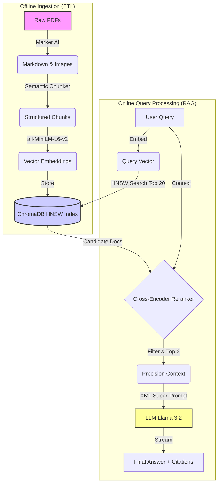

# RAG-Pipeline-Tutorial

<a target="_blank" href="https://cookiecutter-data-science.drivendata.org/">
    
</a>


[](contribution.md)


This is a local Question & Answering tool designed specifically for complex technical documents, such as AI research papers. It runs entirely on your machine using **Ollama** and **ChromaDB**.

### The Problem
Most RAG (Retrieval Augmented Generation) tools fail when reading scientific papers. They convert PDFs into plain text, which destroys **mathematical equations** and **data tables**. If the AI can't read the equation correctly, it can't explain it to you.

### How This Project Solves It
This pipeline is built to handle technical data properly:

* **It keeps the structure:** Instead of extracting plain text, it converts PDFs into **Markdown**. This preserves tables and LaTeX math equations (like $E=mc^2$) so the AI can actually understand them.
* **It searches smarter:** It uses a two-step search process. First, it finds a broad set of possible answers, and then a second model "reads" them to rank the best ones.
* **It reduces errors:** The AI is instructed to strictly use the provided context and cite its sources, reducing the chance of it making things up.


---

## Quick Start

You can set up everything (install dependencies, download the model, ingest data, and start the server) with one command.

```bash
make start-all
```
This will launch the API at http://0.0.0.0:8000.

or

You can set up the entire project with just three commands.

### 1. Prerequisite
Ensure you have `Make`, `Conda` and [Ollama](https://ollama.com/) installed.

### 2. Install
Run these commands in your terminal:

```bash
# 1. Create the Conda environment
make create_environment

# 2. Activate the environment
conda activate rag-pipeline

# 3. Install dependencies
make requirements
```
### 3. Get the Data
Download the seminal ML papers (Attention is All You Need, Llama 2, etc.) automatically:
```bash
make data
```
This downloads the PDFs into `data/raw/`.

## Project Organization

```
├── LICENSE            <- Open-source license if one is chosen
├── Makefile           <- Makefile with convenience commands like `make data` or `make train`
├── README.md          <- The top-level README for developers using this project.
├── data
│   ├── external       <- Data from third party sources.
│   ├── interim        <- Intermediate data that has been transformed.
│   ├── processed      <- The final, canonical data sets for modeling.
│   └── raw            <- The original, immutable data dump.
│
├── docs               <- A default mkdocs project; see www.mkdocs.org for details
│
├── models             <- Trained and serialized models, model predictions, or model summaries
│
├── notebooks          <- Jupyter notebooks. Naming convention is a number (for ordering),
│                         the creator's initials, and a short `-` delimited description, e.g.
│                         `1.0-jqp-initial-data-exploration`.
│
├── pyproject.toml     <- Project configuration file with package metadata for 
│                         RAGPipeline and configuration for tools like black
│
├── references         <- Data dictionaries, manuals, and all other explanatory materials.
│
├── reports            <- Generated analysis as HTML, PDF, LaTeX, etc.
│   └── figures        <- Generated graphics and figures to be used in reporting
│
├── requirements.txt   <- The requirements file for reproducing the analysis environment, e.g.
│                         generated with `pip freeze > requirements.txt`
│
├── setup.cfg          <- Configuration file for flake8
│
└── RAGPipeline   <- Source code for use in this project.
    │
    ├── __init__.py             <- Makes RAGPipeline a Python module
    │
    ├── config.py               <- Store useful variables and configuration
    │
    ├── dataset.py              <- Scripts to download or generate data
    │
    ├── features.py             <- Code to create features for modeling
    │
    ├── modeling                
    │   ├── __init__.py 
    │   ├── predict.py          <- Code to run model inference with trained models          
    │   └── train.py            <- Code to train models
    │
    └── plots.py                <- Code to create visualizations
```

--------

### 4. Architecture: Data Ingestion (ETL)

This pipeline treats data ingestion as the most critical step. 
In technical domains like AI research or Finance, the structure of 
the document *is* the data. If you lose the table formatting or the 
variable relationships in an equation, you lose the answer.

### The Strategy: "Markdown First"
Standard PDF extractors often flatten documents into a single stream 
of a text. This works for simple prose but fails for technical content.

We solve this by converting PDFs into **Markdown**. This format 
naturally preserves hierarchical structure, tables, and mathematical 
notation.

| Feature       | Standard Text Extraction                                 | Markdown Conversion (Our Approach)                                  |
|:--------------|:---------------------------------------------------------|:--------------------------------------------------------------------|
| **Tables**    | Flattens into messy lines. <br> *(e.g. `Model 90% 80%`)* | Preserves structure using pipes. <br> *(e.g. `\| Model \| Acc \|`)* |
| **Math**      | Garbles equations. <br> *(e.g. `E m c 2`)*               | Preserves LaTeX syntax. <br> *(e.g. `$E=mc^2$`)*                    |
| **Structure** | Loses section boundaries.                                | Keeps Headers (`#`, `##`) and hierarchy.                            |

### The Pipeline Steps

1.  **Deep Conversion:** We use **[Marker](https://github.com/datalab-to/marker)**, a deep learning-based tool, to analyze the PDF layout. It doesn't just read text; it identifies headers, formats tables, and converts equations into LaTeX.
2.  **Semantic Chunking:** Instead of blindly cutting text every 1,000 characters (which might split a sentence in half), we split documents based on their **Headers** (`# Introduction`, `## Methods`). This ensures that every chunk represents a complete, logical thought or section.
3.  **Vector Embedding:** The text chunks are converted into 384-dimensional vectors using `sentence-transformers/all-MiniLM-L6-v2`. We chose this model for its high speed and low memory footprint, making it ideal for local CPUs.
4.  **Storage:** Vectors are stored in **ChromaDB**, utilizing an **HNSW (Hierarchical Navigable Small World)** index for millisecond-latency searches.

### A Note on "Parent-Child" Retrieval
A common alternative in RAG is **Parent-Child Retrieval**, where you search using small snippets (Children) but retrieve larger context blocks (Parents).

While highly effective, this method requires maintaining two separate data stores (a Vector Store for search and a Document Store for content) and significantly increases memory overhead. Given that this project is designed to run locally on standard hardware (CPUs/Laptops), we opted for **Semantic Chunking**. It offers a comparable balance of context and precision without the heavy hardware requirements of a full Parent-Child architecture.

### Usage

To run the ingestion pipeline (PDF → Vector DB):

```bash
# 1. Ensure your raw PDFs are downloaded (uses papers.json file to know which papers to download)
make data

# 2. Convert, Chunk, and Index all documents
make ingest

# Option: Test with a single PDF to verify the output
python -m ragpipeline.ingestion --limit 1
```

### 5. Architecture: Retrieval Engine

Retrieval is the most common point of failure in RAG. If you send the 
wrong context to the LLM, it will either hallucinate or say 
"I don't know."

We use a **Two-Stage Retrieval** strategy (also known as 
"Contextual Compression") to solve this.

### The Problem: "Fuzzy" Vectors
Standard vector search (used by 90% of RAG tutorials) is "fuzzy." It matches based on general meaning.
* *Query:* "How does Multi-Head Attention work?"
* *Vector Match:* Might return a paragraph about "paying attention to results" because the vectors are mathematically similar.

Vectors are fast, but they often lack the precision needed for specific technical definitions.

### The Solution: Recall + Reranking

We implemented a two-step pipeline that gives us the **speed** of vectors and the **accuracy** of a reading model.

1.  **Stage 1: High Recall (The "Broad Net")**
    * We use **ChromaDB** with Cosine Similarity to fetch the top **20 documents** related to your query.
    * *Goal:* Don't worry about precision yet; just make sure the right answer is *somewhere* in this pile.

2.  **Stage 2: High Precision (The "Strict Grader")**
    * We pass those 20 documents + the User Query into a **Cross-Encoder** model (`cross-encoder/ms-marco-MiniLM-L-6-v2`).
    * Unlike vector models (Bi-Encoders) that look at the query and document separately, a Cross-Encoder reads them **together**. It asks: *"Does this specific text answer this specific question?"*
    * It assigns a strict relevance score (0.0 to 1.0) to each document.

3.  **The Result:** We discard the low-scoring documents and send only the **Top 3** highest-graded chunks to the LLM.

### Usage
To run a standalone test of the retrieval engine (without the LLM):

```bash
python -m ragpipeline.retrieval

or 

make retrieve
```

### 6. Architecture: Generation Engine (RAG)

The Generation module is the final synthesizer. It takes the messy, 
raw text chunks found by the Retriever and transforms them into a clear, 
accurate answer.

### The Strategy: "Grounded" Generation
A common failure in RAG is **Hallucination** where the LLM ignores your documents and uses its own training data instead.

We solve this using **XML-Structured Prompting** and **Negative Constraints**.

### Key Features

* **XML Super-Prompt:** We don't just paste text into the prompt. We wrap retrieved documents in strict XML tags (`<doc id="1">...</doc>`). This helps the model clearly distinguish between your instructions and the source material.
* **Hallucination Control:** The system prompt includes explicit "Negative Constraints" (e.g., *"If the answer is not in the context, state that you cannot find it"*). This forces the model to admit ignorance rather than making up facts.
* **Precision Citations:** Because we feed the model structured metadata (`source="paper.pdf"`), we instruct it to cite the exact filename for every claim it makes.
* **Streaming Inference:** We use a generator pattern to stream the response token-by-token. This reduces the **Time to First Token (TTFT)** from 5+ seconds to **<200ms**, making the application feel instant even when running on a CPU.

### Usage

To test the full RAG pipeline (Retrieval + Generation) in the terminal:

```bash
# 1. Ensure Ollama is running and the model is downloaded
ollama serve
ollama pull llama3.2:1b

# 2. Run the generation script
make generate

# Alternative: Run the Python module directly
python -m ragpipeline.generation
```

## API Documentation

The backend is built on **FastAPI**, providing a high-performance, asynchronous REST API. It is designed to be deployed as a microservice, decoupled from the frontend interface.

Once the server is running, interactive documentation is auto-generated.

**👉 [Open Swagger UI (Interactive Docs)](http://localhost:8000/docs)**

### Key Endpoints

| Method | Endpoint        | Description                                                                                                                                                            |
|:-------|:----------------|:-----------------------------------------------------------------------------------------------------------------------------------------------------------------------|
| `GET`  | `/health`       | **Liveness Probe.** Returns `200 OK` only when models (Embedding, Reranker, LLM) are loaded into memory. The UI polls this endpoint before loading the chat interface. |
| `POST` | `/api/v1/query` | **Inference Engine.** The main RAG endpoint. Accepts a JSON payload, orchestrates the two-stage retrieval, and streams the generative response.                        |

### Example Request

You can test the API directly from your terminal.

*Note: The `k` parameter controls how many documents are sent to the LLM after reranking.*

```bash
curl -X 'POST' \
  'http://localhost:8000/api/v1/query' \
  -H 'Content-Type: application/json' \
  -d '{
  "query": "How does Scaled Dot-Product Attention differ from additive attention?",
  "k": 3
}'
```

#### Example Response
Notice the high relevance scores (e.g., 0.98). This indicates that our Cross-Encoder Reranker has successfully identified highly pertinent information, filtering out noise.
```json
{
  "answer": "Scaled Dot-Product Attention is mathematically identical to Dot-Product attention, except for a scaling factor of $1/\\sqrt{d_k}$. Additive attention, in contrast, uses a feed-forward network with a single hidden layer to compute compatibility functions. While theoretical complexity is similar, dot-product attention is faster and more space-efficient in practice due to optimized matrix multiplication libraries (Source: attention_is_all_you_need.pdf).",
  "sources": [
    {
      "source": "attention_is_all_you_need.pdf",
      "score": 0.982,
      "content_preview": "We call our particular attention 'Scaled Dot-Product Attention'. The input consists of queries and keys of dimension dk..."
    },
    {
      "source": "attention_is_all_you_need.pdf",
      "score": 0.945,
      "content_preview": "The two most commonly used attention functions are additive attention [2], and dot-product (multiplicative) attention..."
    }
  ]
}
```
---

##  Frontend Interface

The project includes a production-ready web interface built with
**Streamlit**. It is designed for reliability and ease of use.

**Launch it:**
```bash
make run-streamlit
# Opens http://localhost:8501
```
### Key Features
1. **Auto-Healing Connection:** The UI automatically checks if the Backend API is healthy on startup. If the backend is down, it shows a "Waiting for Server" spinner instead of crashing.
2. **Session Management:** Chat history is preserved during your session.
3. **Rich Text Rendering:** Full support for Markdown, Code Blocks, and Tables returned by the LLM. 
4. **Citation Accordions:** Sources are tucked away in neat expanders to keep the chat clean.

##  Contributing
I welcome contributions or Improvements for the Existing Pipeline. Please
read our [Contribution Guidelines](contribution.md) to get started.
